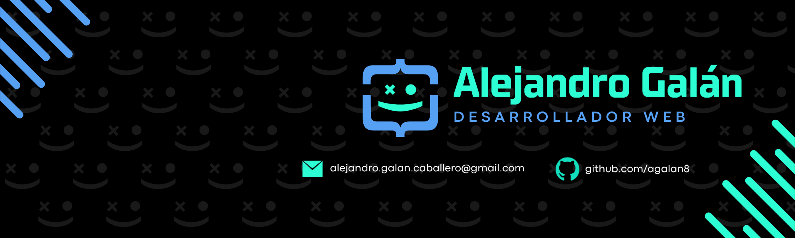

  

###

  

###

<h1 align="left">Hey, I'm Alejandro</h1>

###

  I’m a web developer committed to delivering high-quality, efficient, and scalable solutions. Passionate about continuous learning and collaboration, I always strive to create impactful digital products that solve real-world problems. Let’s build something great together!

###

<h2 align="center">LANGUAGES</h2>

###

  
  
  
  
  
  
  
  
  
  
  

###

<h2 align="center">FRAMEWORKS & LIBRARIES</h2>

###

  
  
  
  
  
  
  

###

<h2 align="center">DATABASES</h2>

###

  
  
  
  
  

###

<h2 align="center">TOOLS</h2>

###

  
  
  
  
  
  
  

###

<h2 align="center">VERSION CONTROL</h2>

###

  
  
  

###

<h2 align="center">GITHUB STATS</h2>

###

  
  

